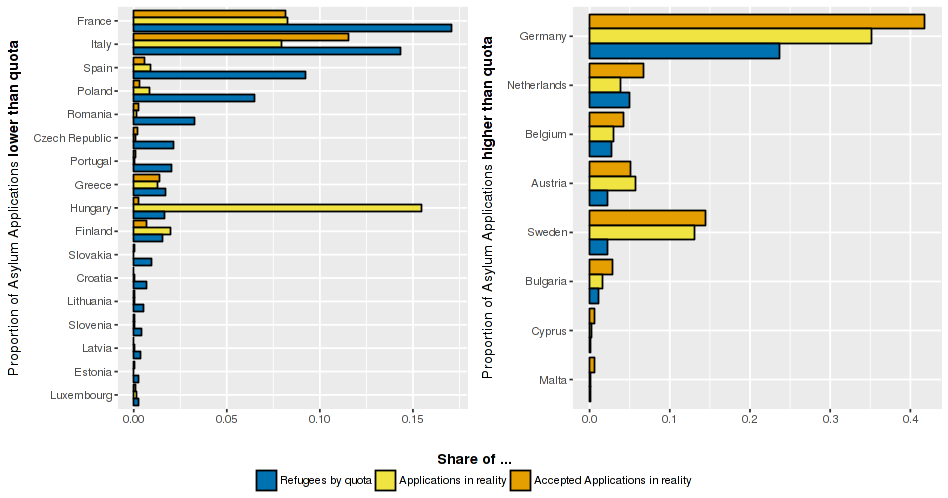

# Distributing Asylum Applications across Europe with a Quota

[See the Explanation included in the App.](https://github.com/georgeblck/refugee-distribution/blob/master/shiny/markdown.md)

# Updates
## 4.1.2018
### GDP
* One more year of GDP Data from Eurostat (ends at 2016 now)
* Still no new Liechtenstein GDP Data (ends at 2013)
* Swiss GDP Data is now included in Eurostat (ends at 2016)

### Population
* Updated all Population data from Eurostat (ends at 2016 now)

### Unemployment data
* Updated all Eurostat Data (ends at 2016)
* Updated Liechtenstein Data to 2016
* An entirely new & official data set was found for Switzerland (up to 2016) with strong differences (find it [here](https://www.bfs.admin.ch/bfs/de/home/statistiken/kataloge-datenbanken/tabellen.assetdetail.3783413.html))

### Asylum data
* Eurostat - Asylum and first time asylum applicants (after 2007) updated to Nov. 2017
* Eurostat - First Time applicants till 2007 (monthly) updated
* Eurostat - Asylum Applicants till 2007 (annual) updated
* Eurostat - Accepted Asylum Seekers updated till 2007Q3

### Misc
* CHF exchange rate not update because not necessary
